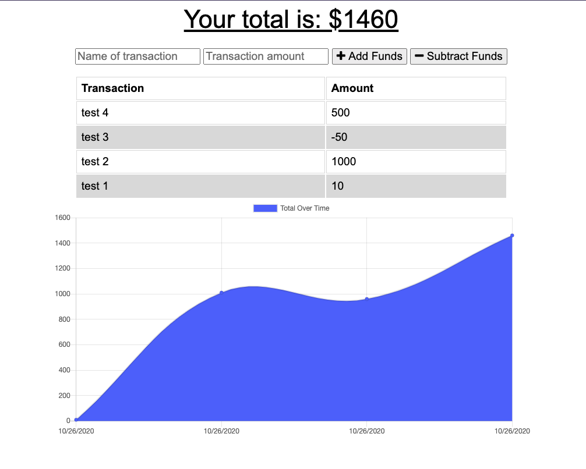

# Budget App

This budget app is a progressive web application, which means it can be installed as a native-style application onto your device as well as accessed through a browser. It also works offline, storing any changes you make in cache until a connection with the server is reestablished.

Deployed app: [https://spacialfray-budget-pwa.herokuapp.com/](https://spacialfray-budget-pwa.herokuapp.com/)

---

## License

